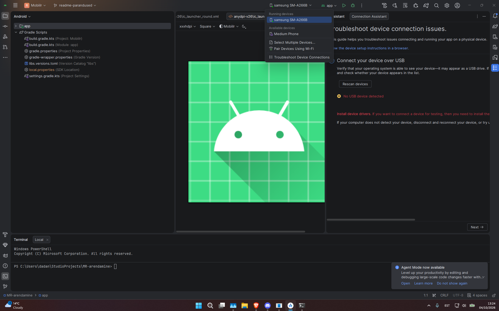
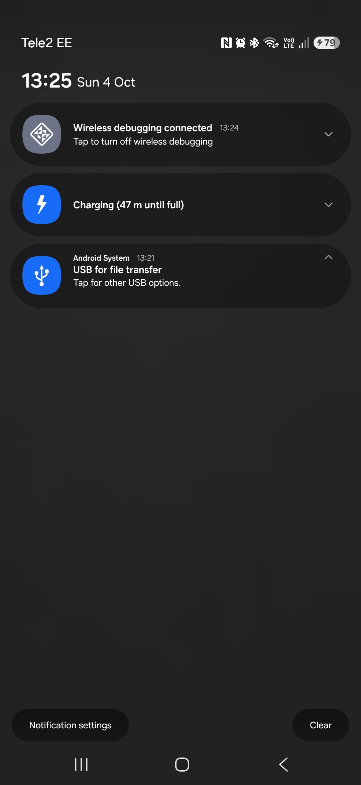
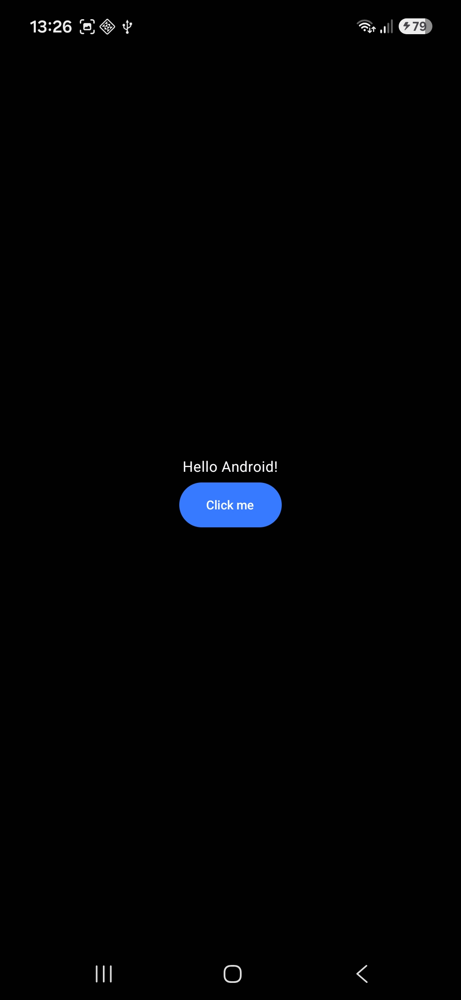
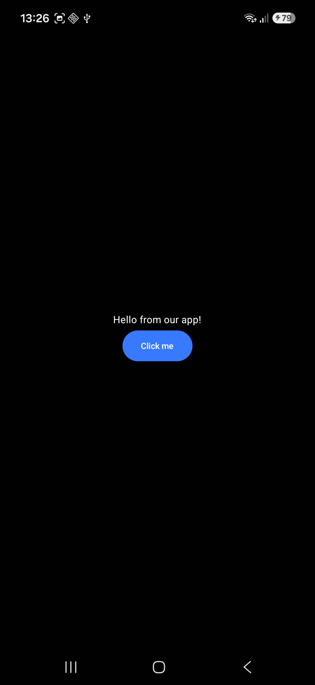
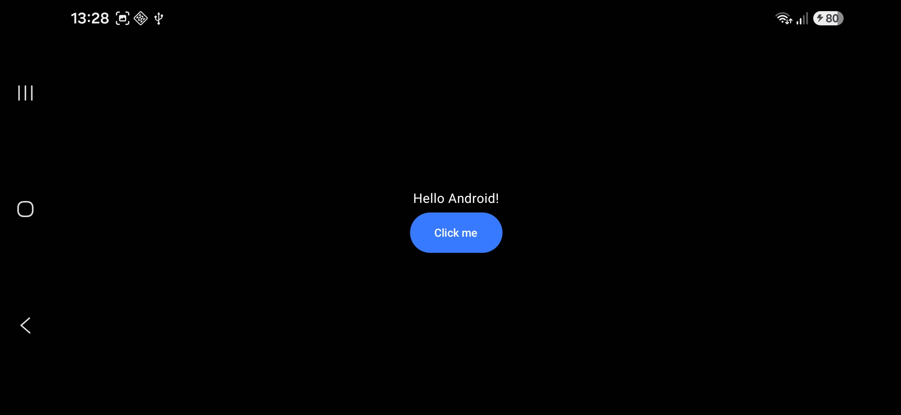
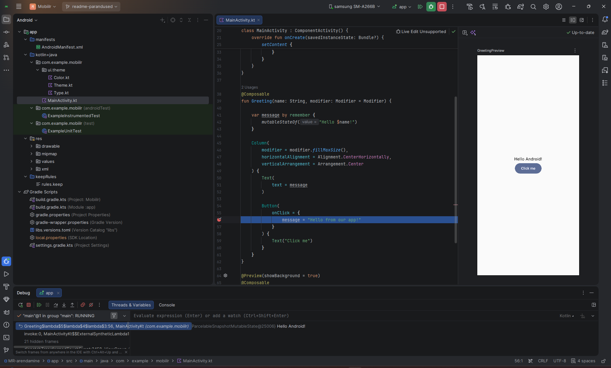

# Mobiilrakenduste arendamine - Grupp 0

## Tech stack

- Android Studio Quail 4 (2026.1.4)
- Android Gradle Plugin 9.4.1
- Kotlin 2.2.10
- Jetpack Compose (BOM 2026.02.01), Material 3
- compileSdk ja targetSdk 37, minSdk 24 (Android 7.0)
- Java 11

## Installatsioon

### Eeldused

- Android Studio Quail 4 (2026.1.4) või uuem
- Android SDK Platform 37 (Tools → SDK Manager)
- Git
- Android Emulator või füüsiline Android-seade (Android 7.0 või uuem)

### 1. Projekti hankimine

```bash
git clone https://github.com/vaikotuul/MR-arendamine
```

Ava kloonitud kaust Android Studios (File → Open) ja oota, kuni Gradle'i sünkroniseerimine lõpeb.

### 2. Käivitusseade

#### Emulaator

Ava Tools → Device Manager → Create Virtual Device. Vali profiil Medium Phone ja süsteemipilt Android 17.0 (API 37).

#### Füüsiline seade USB-ga

1. Ava telefonis Settings → About phone → Software information ja vajuta Build number 7 korda.
2. Lülita Developer options all sisse USB debugging.
3. Ühenda telefon USB-kaabliga ja luba telefonis küsimus Allow USB debugging?.

#### Füüsiline seade Wi-Fi kaudu

Meie ühendasime telefoni Wi-Fi kaudu, sest arvuti ei näinud seda USB-ga (vt Probleemid). Arvuti ja telefon peavad olema samas Wi-Fi võrgus.

1. Ava telefonis Developer options → Wireless debugging, lülita see sisse ja vali Pair device with pairing code. Telefon näitab koodi ning IP-aadressi ja porti.
2. Käivita arvutis PowerShellis:

```powershell
& "$env:LOCALAPPDATA\Android\Sdk\platform-tools\adb.exe" pair IP:PAARITAMISE_PORT
```

3. Sisesta telefonis näidatud kood.
4. Ühenda seade Wireless debugging põhiekraanil näidatud IP-aadressi ja pordiga:

```powershell
& "$env:LOCALAPPDATA\Android\Sdk\platform-tools\adb.exe" connect IP:PORT
```

Telefon ilmub nüüd Android Studio seadmete rippmenüüsse.





### 3. Rakenduse käivitamine

Vali seade rippmenüüst ja vajuta Run. Android Studio ehitab rakenduse, paigaldab selle seadmesse ja avab selle.

### Probleemid

Android Studio ei näinud telefoni USB-ga, kuigi Windows näitas telefoni faile. Käsk `adb devices` tagastas tühja loendi. Ühendasime telefoni Wi-Fi kaudu ja see töötas.

Vene keelses telefonis ei leidnud otsing Wireless debugging seadet. Kui panime telefoni keeleks ajutiselt inglise keele, oli seade Developer options all olemas.

Breakpoint ei peatanud rakendust, vaid rakendus käivitus uuesti. Punane täpp polnud reale pandud. Pärast klõpsu rea numbri kõrval rakendus peatus.

## Testimine

### Testkeskkonnad

- Virtuaalseade: Android Emulator, Medium Phone, Android 17.0 ("CinnamonBun"), API 37
- Füüsiline seade: Samsung Galaxy A26 (SM-A266B), Android 16 (One UI 8.5), API 36

### Käsitsi testimine füüsilises seadmes

| # | Samm | Oodatud tulemus | Tulemus |
| --- | --- | --- | --- |
| 1 | Käivita rakendus | Rakendus avaneb veata | Töötab |
| 2 | Vaata avaekraani | Keskel on tekst „Hello Android!" ja nupp „Click me" | Töötab |
| 3 | Vajuta nuppu | Tekst muutub: „Hello from our app!" | Töötab |
| 4 | Pööra telefon horisontaalseks | Tekst ja nupp jäävad keskele | Töötab |

Enne nupu vajutamist:



Pärast nupu vajutamist:



Horisontaalasendis:



### Debugger

1. Ava `MainActivity.kt` ja pane breakpoint reale `message = "Hello from our app!"` (nupu `onClick` sees).
2. Käivita rakendus nupuga Debug, mitte Run.
3. Vajuta telefonis nuppu „Click me".

Rakendus peatus sellel real. Debug-paneelis on näha `message` olek, mille väärtus on veel „Hello Android!", sest rida pole veel täidetud.



## Meie muudatused

Aluseks võtsime Android Studio Jetpack Compose'i vaikemalli. Muudatused failis `MainActivity.kt`:

- tervitustekst hoitakse olekus (`remember { mutableStateOf(...) }`), et seda saaks muuta;
- sisu on paigutatud `Column`-i, mis joondab selle ekraani keskele;
- lisasime nupu „Click me";
- nupu vajutamine muudab teksti ja Compose joonistab ekraani uuesti.

